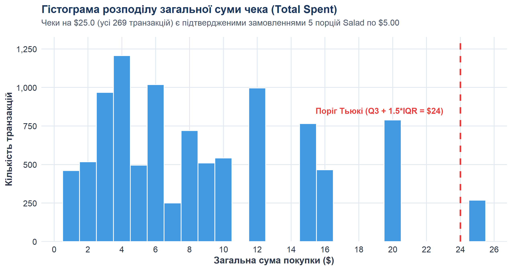
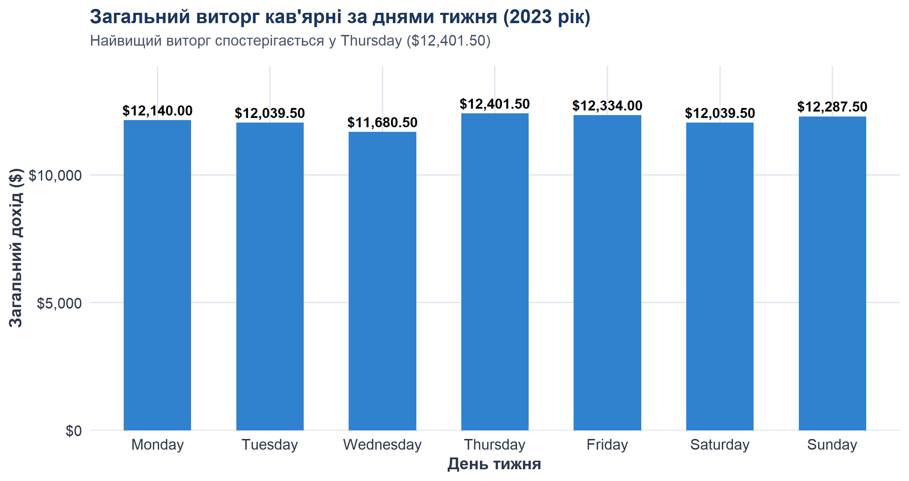
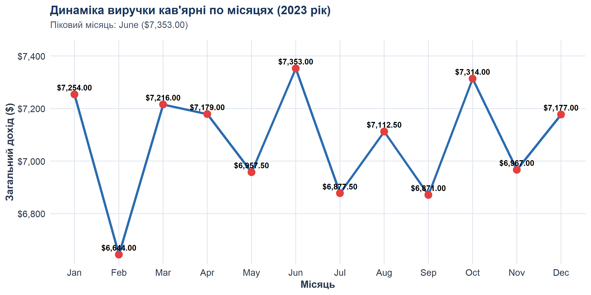

# Cafe Sales Data Cleaning in R

[](https://www.r-project.org/)
[](#key-results)

Лабораторна робота з комплексного аудиту якості, детермінованого очищення транзакційних даних кав'ярні та інженерії ознак для подальшого аналізу й моделювання. Проєкт реалізовано мовою **R** із забезпеченням суворої відтворюваності, валідації бізнес-правил та ізоляції від витоку даних (*data leakage*).

---

## About

Метою роботи є виявлення та усунення прихованих дефектів у сирих даних (технічних псевдопропусків `"ERROR"`, `"UNKNOWN"`, синтаксичних збоїв логування), детермінована реконструкція втрачених значень за формулою чека `Total = Quantity * Price` без штучного спотворення розподілів, оцінка фінансового впливу очищення на виручку та підготовка безпечного набору ознак для машинного навчання.

---

## Tech Stack

- **R 4.6.1** (CRAN release, 64-bit ucrt)
- **Jupyter Notebook** (ядро IRkernel)
- **readr** — типізований потоковий імпорт та експорт даних
- **dplyr** / **tidyr** — конструювання конвеєрів перетворення даних
- **stringr** — нормалізація текстових маркерів
- **lubridate** — календарний парсинг та виділення часових ознак
- **ggplot2** / **scales** — публікаційна аналітична візуалізація

---

## Project Structure

```text
cafe-sales-data-cleaning/
├── README.md                                          # Документація репозиторію
├── .gitignore                                         # Налаштування виключень
├── cafe_sales_data_cleaning.R                         # Автономний R-скрипт повного циклу
├── lab_data_cleaning_cafe_sales_self_guided_r.ipynb   # Інтерактивний Jupyter Notebook
├── data/
│   ├── raw/
│   │   └── dirty_cafe_sales.csv                       # Вихідний датасет (10 000 рядків)
│   └── processed/
│       ├── cleaned_cafe_sales.csv                     # Очищений набір даних (10 000 рядків)
│       └── suspicious_cafe_sales.csv                  # Реєстр неповних записів для аудиту (6 229 рядків)
├── figures/
│   ├── 01_quantity_distribution.png                   # Розподіл кількості товарів
│   ├── 02_price_distribution.png                      # Розподіл цін меню
│   ├── 03_total_spent_distribution.png                # Гістограма чеків із порогом Тьюкі
│   ├── 04_total_spent_boxplot.png                     # Діаграма розмаху Total Spent
│   ├── 05_revenue_by_weekday.png                      # Динаміка виручки за днями тижня
│   └── 06_revenue_by_month.png                        # Щомісячна динаміка виручки
└── report/
    ├── REPORT.md                                      # Повний академічний звіт
    ├── REPORT.html                                    # Стилізована HTML-версія звіту
    ├── results_summary.csv                            # Зведена таблиця контрольних метрик
    └── execution_output.txt                           # Лог консольного виконання R-пайплайну
```

---

## Data Cleaning Pipeline

1. **Типізований текстовий імпорт:** Безпечне зчитування всіх стовпців як `character` для збереження первинного вигляду текстових маркерів помилок.
2. **Уніфікація псевдопропусків:** Аудит значень `""`, `"ERROR"`, `"UNKNOWN"`, `"NA"`, `"NULL"` та їх конвертація у системний `NA`.
3. **Детерміноване відновлення цін:** Підтягування вартості з прайсу меню за назвою товару (479 цін), розрахунок `Price = Total / Quantity` (48 цін) та унікальні суми чека (2 ціни). Всього відновлено 529 цін.
4. **Відновлення товарів за унікальною ціною:** Реконструкція позицій з однозначною вартістю ($1 Cookie, $1.5 Tea, $2 Coffee, $5 Salad; відновлено 490 назв; неоднозначні ціни $3 та $4 залишено як `NA`).
5. **Детерміноване відновлення кількості:** Обчислення `Quantity = round(Total / Price)` з перевіркою цілочисельності та діапазону 1–5 (відновлено 456 значень) та з унікальних сум (2 значення). Всього відновлено 458 значень.
6. **Реконструкція суми чека:** Обчислення контрольної суми `calculated_total = Quantity * Price` та відновлення пропущених чеків (відновлено 479 сум).
7. **Календарна інженерія та прапорці якості:** Парсинг дат за стандартом ISO 8601, виділення часових ознак та маркування записів прапорцями аудиту походження (`had_any_raw_defect`) і залишкової неповноти (`is_suspicious`).

---

## Key Results

| Показник | До очищення (Raw) | Після очищення (Cleaned) | Різниця / Вплив |
|---|---:|---:|---:|
| **Загальна кількість рядків** | 10 000 | 10 000 | Збережено 100% спостережень |
| **Рядки з первинними дефектами** | 6 911 | — | Повністю задокументовано в audit trail |
| **Валідні транзакції з сумою** | 9 498 | **9 977** | **+479 відновлених чеків (+5.04%)** |
| **Сукупна виручка кав'ярні** | $84 763.50 | **$89 096.00** | **+$4 332.50 (+5.11%)** |
| **Середній чек (Mean Total Spent)** | $8.92 | $8.93 | Зміна на +$0.01 (структура стабільна) |
| **Медіанний чек (Median Total Spent)** | $8.00 | $8.00 | Медіана залишилася незмінною |
| **Неповні записи після очищення (`is_suspicious`)** | — | **6 229** | Збережено для бізнес-аудиту |
| **Транзакції без валідної дати** | 460 | 460 | Залишено як `NA` без штучної інтерполяції |

---

## Visualizations

### 1. Розподіл суми транзакції (Total Spent) та формальні викиди
Усі чеки на $25.0 формально перевищують поріг Тьюкі ($Q3 + 1.5 \times IQR = 24.0$). Проте бізнес-аналіз довів, що це замовлення 5 порцій салату за ціною $5.0 ($5 \times 5 = 25$). Усі 269 таких чеків у очищеному датасеті є валідними покупками:

<p align="center">
  
</p>

### 2. Динаміка виручки за днями тижня та місяцями
Найбільшу виручку кав'ярня генерує у **четвер ($12 401.50)** та **п'ятницю ($12 334.00)**. Серед місяців пік виручки припадає на **червень ($7 353.00)** та **жовтень ($7 314.00)**:

<p align="center">
  
  
</p>

---

## Run

Для повного відтворення всього циклу очищення, валідації, збереження процесованих датасетів та генерації графіків запустіть:

```bash
Rscript cafe_sales_data_cleaning.R
```

Або відкрийте `lab_data_cleaning_cafe_sales_self_guided_r.ipynb` в JupyterLab / VS Code та виконайте **Kernel -> Restart & Run All**.

Звіт компілюється з Markdown у HTML за допомогою Pandoc:

```bash
pandoc report/REPORT.md -o report/REPORT.html --standalone
```

---

## Reports

- **Повний аналітичний звіт (Markdown):** [report/REPORT.md](report/REPORT.md)
- **Стилізована HTML-версія звіту:** [report/REPORT.html](report/REPORT.html)
