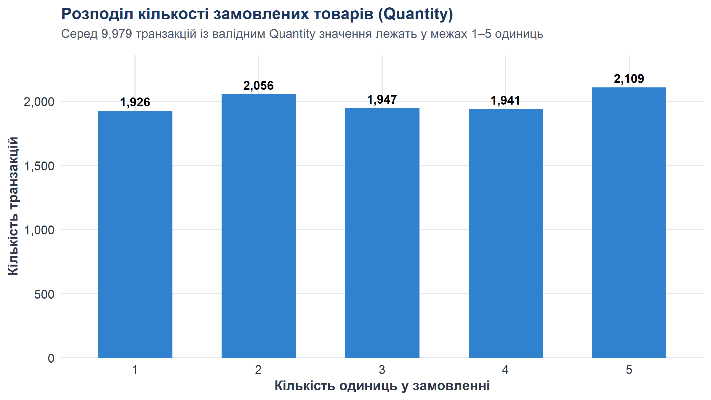
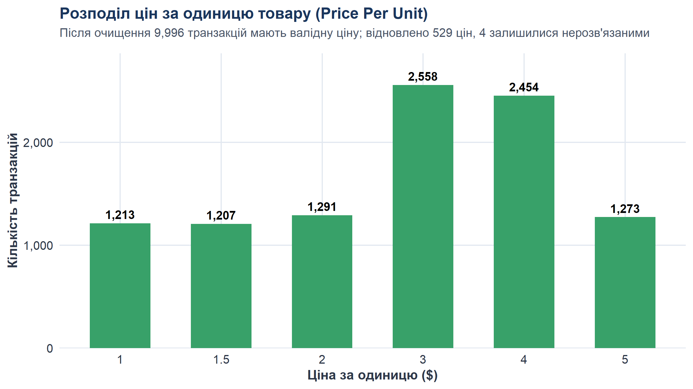
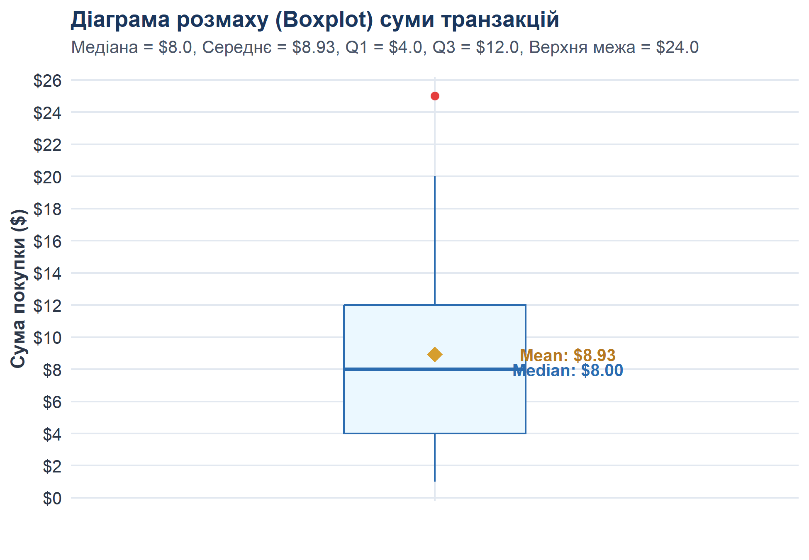

# Лабораторна робота — очищення та підготовка даних Cafe Sales до аналізу та машинного навчання

## Титульна інформація

- **Дисципліна:** Основи машинного навчання / Аналіз даних
- **Тема:** Очищення та підготовка даних до моделювання (Data Cleaning & Feature Engineering)
- **Мова програмування:** R (версія 4.6.1 ucrt, 64-bit)
- **Середовище розробки:** Jupyter Notebook (IRkernel) та автономний Rscript
- **Основний виконуваний ноутбук:** [`lab_data_cleaning_cafe_sales_self_guided_r.ipynb`](../lab_data_cleaning_cafe_sales_self_guided_r.ipynb)
- **Автономний R-скрипт:** [`cafe_sales_data_cleaning.R`](../cafe_sales_data_cleaning.R)
- **Початковий набір даних:** [`data/raw/dirty_cafe_sales.csv`](../data/raw/dirty_cafe_sales.csv)
- **Результуючі файли:**
  - Очищений набір даних: [`data/processed/cleaned_cafe_sales.csv`](../data/processed/cleaned_cafe_sales.csv)
  - Реєстр підозрілих / неповних транзакцій: [`data/processed/suspicious_cafe_sales.csv`](../data/processed/suspicious_cafe_sales.csv)
  - Зведені контрольні метрики: [`report/results_summary.csv`](results_summary.csv)
  - Журнал виконання R: [`report/execution_output.txt`](execution_output.txt)

---

## 1. Мета роботи

Метою цієї лабораторної роботи є проведення всебічного аудиту якості сирих транзакційних даних мережі кав'ярень, виявлення дефектів обліку (технічних псевдопропусків, помилок касового логування, порушень цілісності типів даних та узгодженості формули чека), побудова повністю детермінованого конвеєра очищення (Data Cleaning Pipeline) на мові R, оцінка фінансового впливу реконструкції даних на виручку закладу та підготовка набору ознак для машинного навчання із суворим запобіганням витоку даних (Data Leakage).

---

## 2. Вихідний набір даних

Початковий файл `data/raw/dirty_cafe_sales.csv` містить журнал продажів кав'ярні обсягом **10 000 рядків** та **8 стовпців**. При прямому читанні бібліотекою `readr::read_csv()` порожні комірки CSV інтерпретуються як системні `NA`, тоді як технічні маркери помилок (`"ERROR"`, `"UNKNOWN"`) зчитуються як звичайний текст. Через це середовище R автоматично розпізнає всі 8 колонок як текстові (`character`).

### Таблиця структури змінних

| Поле | Початковий тип | Очікуваний тип | Призначення та семантика |
|---|---|---|---|
| `Transaction ID` | `character` | `character` (унікальний ключ) | Унікальний номер транзакції (формат `TXN_XXXXXXX`) |
| `Item` | `character` | `factor` / `categorical` | Назва замовленої позиції меню кав'ярні |
| `Quantity` | `character` | `integer` / `numeric` | Кількість замовлених одиниць товару в чеку |
| `Price Per Unit` | `character` | `numeric` / `double` | Ціна за одиницю товару в доларах США (USD) |
| `Total Spent` | `character` | `numeric` / `double` | Загальна сума покупки за чеком (USD) |
| `Payment Method` | `character` | `factor` / `categorical` | Спосіб оплати (готівка, платіжна картка, цифровий гаманець) |
| `Location` | `character` | `factor` / `categorical` | Канал обслуговування (на винос / Takeaway чи в закладі / In-store) |
| `Transaction Date` | `character` | `Date` (YYYY-MM-DD) | Календарна дата здійснення операції |

---

## 3. Використані R-бібліотеки

| Бібліотека | Версія | Призначення у лабораторній роботі |
|---|---|---|
| `readr` | 2.2.0 | Швидкий імпорт CSV із фіксацією типів (`col_types = cols(.default = "c")`) та експорт фінальних наборів |
| `dplyr` | 1.2.1 | Маніпуляція даними, фільтрація, створення нових ознак (`mutate`), групування та агрегація (`summarise`) |
| `tidyr` | 1.3.2 | Структурування даних та робота з пропущеними значеннями |
| `stringr` | 1.6.0 | Обробка рядкових даних, очищення від пробілів (`trimws`) та маніпуляції з маркерами |
| `lubridate` | 1.9.5 | Парсинг текстових дат у календарний формат (`ymd`), виділення року, місяця, дня та дня тижня |
| `ggplot2` | 4.0.3 | Побудова публікаційних аналітичних візуалізацій (гістограми, діаграми розмаху, стовпчикові графіки) |
| `scales` | 1.4.0 | Форматування числових шкал (грошові позначення, роздільники тисяч) на графіках |

---

## 4. Поетапний опис виконання роботи

### 4.1. Первинний аудит даних

#### Що перевірялося:
Розмірність таблиці, назви стовпців, фактичні типи в R, перші та останні записи, зведена описова статистика та наявність системних `NA` одразу після імпорту.

#### Ключовий R-код:
```r
sales_raw <- read_csv("data/raw/dirty_cafe_sales.csv", col_types = cols(.default = "c"), show_col_types = FALSE)
sales_raw_snapshot <- sales_raw # Immutability check

dim(sales_raw)
sapply(sales_raw, class)
colSums(is.na(sales_raw))
```

#### Отримані результати:
- Розмірність: **10 000 рядків, 8 колонок**.
- Усі 8 колонок зчитано як `character`.
- Системні `NA`, зафіксовані одразу після імпорту порожніх комірок CSV:
  - `Transaction ID`: **0**
  - `Item`: **333**
  - `Quantity`: **138**
  - `Price Per Unit`: **179**
  - `Total Spent`: **173**
  - `Payment Method`: **2 579**
  - `Location`: **3 265**
  - `Transaction Date`: **159**

#### Висновок:
Частина дефектів (порожні комірки) уже під час імпорту набула системного статусу `NA`, тоді як текстові маркери `ERROR` та `UNKNOWN` залишилися звичайними рядками. 7 із 8 колонок містять дефекти і потребують глибокого аудиту. Єдиний стовпець без дефектів — `Transaction ID` (10 000 валідних унікальних номерів).

---

### 4.2. Повний аудит псевдопропусків та маркерів дефектів

#### Що перевірялося:
Частота появи кожного типу дефекту: системні `NA`, порожні рядки `""`, службові маркери `"ERROR"`, `"UNKNOWN"`.

#### Зведена таблиця первинних дефектів за колонками:

| Поле | Formal NA | Порожні рядки | Маркер ERROR | Маркер UNKNOWN | Всього дефектів | Частка дефектів |
|---|---:|---:|---:|---:|---:|---:|
| `Transaction ID` | 0 | 0 | 0 | 0 | **0** | 0.00% |
| `Item` | 333 | 0 | 292 | 344 | **969** | 9.69% |
| `Quantity` | 138 | 0 | 170 | 171 | **479** | 4.79% |
| `Price Per Unit` | 179 | 0 | 190 | 164 | **533** | 5.33% |
| `Total Spent` | 173 | 0 | 164 | 165 | **502** | 5.02% |
| `Payment Method` | 2 579 | 0 | 306 | 293 | **3 178** | 31.78% |
| `Location` | 3 265 | 0 | 358 | 338 | **3 961** | 39.61% |
| `Transaction Date` | 159 | 0 | 142 | 159 | **460** | 4.60% |

#### Важливі системні показники:
- **Загальна кількість рядків із хоча б одним дефектом у сирих даних:** **6 911** (69.11% вибірки).
- **Сумарна кількість дефектних числових комірок:** **1 514** (479 + 533 + 502).
- **Унікальних рядків із дефектами в числових полях:** **1 456**.

---

### 4.3. Аудит числових полів та логіки меню

#### Що перевірялося:
Діапазони значень, квантилі, середні величини та відповідність пар `Item -> Price` офіційному прейскуранту кав'ярні.

#### Встановлені відповідності меню:
- **Cookie:** 1.00 USD (унікальна ціна)
- **Tea:** 1.50 USD (унікальна ціна)
- **Coffee:** 2.00 USD (унікальна ціна)
- **Cake:** 3.00 USD (спільна ціна з Juice)
- **Juice:** 3.00 USD (спільна ціна з Cake)
- **Sandwich:** 4.00 USD (спільна ціна зі Smoothie)
- **Smoothie:** 4.00 USD (спільна ціна з Sandwich)
- **Salad:** 5.00 USD (унікальна ціна)

#### Висновок аудиту зворотного зв'язку Price -> Item:
- Ціни 1.0, 1.5, 2.0 та 5.0 USD однозначно ідентифікують товар (`Cookie`, `Tea`, `Coffee`, `Salad`).
- Ціни 3.0 та 4.0 USD закріплені за парами позицій меню. Автоматичне призначення назви товару для них без додаткової інформації є неприпустимим.

---

### 4.4. Логічна перевірка узгодженості формули чека в сирих даних

#### Що перевірялося:
Виконання рівності `Total Spent == Quantity * Price Per Unit` для всіх спостережень, де всі три поля присутні одночасно.

#### Отримані результати:
- Доступно для перевірки: **8 544 рядки**.
- Повністю узгоджені: **8 544 рядки (100.00%)**.
- Невідповідностей формули: **0**.
- Неможливо перевірити через пропуски: **1 456 рядків**.

#### Висновок:
Усі доступні для прямої перевірки чеки ідеально підтверджують роботу касового алгоритму. Це дає строге математичне обґрунтування для детермінованого відновлення втрачених значень за формулою чека.

---

### 4.5. Аналіз унікальності комбінацій для відновлення чеків

При аналізі записів, де відома лише сума чека `Total Spent`, але втрачені і `Quantity`, і `Price Per Unit`, було досліджено всі можливі добутки цін меню `{1.0, 1.5, 2.0, 3.0, 4.0, 5.0}` на допустимі кількості `{1, 2, 3, 4, 5}`:

| Сума чека (Total) | Кількість можливих пар (Price, Quantity) | Єдина допустима комбінація | Можливість відновлення |
|---|:---:|---|---|
| **25.00 USD** | **1** | Price = 5.0, Quantity = 5 (Salad) | **Повне детерміноване відновлення** |
| **9.00 USD** | **1** | Price = 3.0, Quantity = 3 | **Відновлення Q=3, P=3 (Item залишається NA)** |
| 20.00 USD | 2 | P=4 * Q=5 АБО P=5 * Q=4 | Неоднозначно (залишається нерозв'язаним NA) |

---

### 4.6. Аудит дублікатів та категоріальних полів

- **Повні рядкові дублікати:** **0**.
- **Дублікати ідентифікаторів `Transaction ID`:** **0** (усі 10 000 унікальні).
- **Категоріальні змінні:** `Payment Method` та `Location` мають уніфікований регістр і не містять синтаксичних помилок; дефекти представлені виключно пропусками та маркерами `ERROR`/`UNKNOWN`.

---

### 4.7. Аудит дат та календарний Feature Engineering

- **Успішно розпізнано:** **9 540 дат**.
- **Нерозпізнаних значень:** **460** (159 системних NA, 159 `UNKNOWN`, 142 `ERROR`).
- **Календарний діапазон:** з `2023-01-01` по `2023-12-31` (строго 2023 рік).
- **Створені календарні ознаки:** `Year`, `Month`, `Month_Num`, `Day`, `Day_of_Week`.

---

### 4.8. Аналіз аномалій (Outliers)

#### Що перевірялося:
Розрахунок міжквартильного розмаху (IQR) для числових змінних та візуалізація розподілу `Total Spent`.

#### Отримані результати:
- Q1 = 4.0, Median = 8.0, Q3 = 12.0, IQR = 8.0.
- Верхня межа за правилом Тьюкі: 12.0 + 1.5 * 8.0 = 24.0.
- У сирих даних зафіксовано **259 чеків** на суму 25.00 USD.
- В очищених даних зафіксовано **269 чеків** на суму 25.00 USD (додалося 10 чеків, де первинний Total був відсутній і відновлений як 5 порцій Salad по 5.00 USD).
- **Змістовна перевірка:** Усі 269 транзакцій на суму 25.00 USD є на 100% підтвердженими валідними замовленнями 5 порцій салату за ціною 5.00 USD (5 * 5 = 25).

#### Візуалізації:
Нижче наведено розподіли ознак та ілюстрацію межі викидів:


*Рис. 1. Розподіл кількості замовлених товарів у чеку (Quantity).*


*Рис. 2. Розподіл вартості одиниці товару за меню кав'ярні (Price Per Unit).*


*Рис. 3. Гістограма сум чеків (Total Spent) із підсвічуванням формальних викидів IQR.*


*Рис. 4. Діаграма розмаху (Boxplot) суми транзакцій.*

---

## 5. Опис конвеєра очищення (Cleaning Pipeline)

Очищення реалізовано у вигляді строго детермінованого неруйнівного конвеєра:

```
[Raw CSV] 
   │
   ▼
1. Стандартизація маркерів (to_na) та числовий парсинг
   │
   ▼
2. Відновлення Price з відомого Item (479 цін)
   │
   ▼
3. Відновлення Price з Total / Quantity за меню (48 цін)
   │
   ▼
4. Унікальне відновлення для Total=25 (P=5, Q=5) та Total=9 (P=3, Q=3) (2 чеки)
   │
   ▼
5. Відновлення Item за унікальними цінами $1, $1.5, $2, $5 (490 товарів)
   │
   ▼
6. Відновлення Quantity з Total / Price (456 кількостей)
   │
   ▼
7. Розрахунок calculated_total та відновлення Total Spent (479 сум)
   │
   ▼
8. Контрольна валідація узгодженості сум (9 976 з 9 976, 100.00%)
   │
   ▼
9. Календарний Feature Engineering та формування прапорців якості
```

### Дворівнева система прапорців аудиту:
1. **Первинний слід дефектів (Raw Audit Trail):**
   - `had_any_raw_defect`: рядок спочатку містив дефект (**6 911 рядків**);
   - `was_item_recovered`: відновлено товар (**490 рядків**);
   - `was_price_recovered`: відновлено ціну (**529 рядків**);
   - `was_quantity_recovered`: відновлено кількість (**458 рядків**);
   - `was_total_recovered`: відновлено суму чека (**479 рядків**).
2. **Залишкові нерозв'язані дефекти після очищення (Post-cleaning Missing Flags):**
   - `has_missing_item`: **479 рядків** (ціни $3.0 та $4.0 або відсутня ціна);
   - `has_missing_quantity`: **21 рядок**;
   - `has_missing_price`: **4 рядки**;
   - `has_missing_total`: **23 рядки**;
   - `has_missing_payment`: **3 178 рядків**;
   - `has_missing_location`: **3 961 рядок**;
   - `has_missing_date`: **460 рядків**;
   - `is_suspicious`: **6 229 рядків** (наявність хоча б одного нерозв'язаного поля; саме ці рядки експортуються у `suspicious_cafe_sales.csv`).

---

## 6. Журнал очищення даних (Data Cleaning Log)

| Проблема | Як виявлено | Правило обробки (Дія) | Кількість елементів | Обґрунтування правила |
|---|---|---|---:|---|
| Текстові маркери помилок у числових стовпцях | Аудит типів і `as.numeric()` | Конвертація в системний `NA` | 1 514 комірок (1 456 рядків) | Текст `"ERROR"` не є числом; заміна на `NA` уможливлює коректні обчислення |
| Пропуски у сумі чека `Total Spent` | Порівняння з `Quantity * Price` | Розрахунок `calculated_total` | 479 рядків | Ліквідує штучну недооцінку виручки кав'ярні |
| Пропуски ціни при відомому товарі | Крос-таблиця `Item` та `Price` | Підтягування фіксованої вартості меню | 479 рядків | Позиції меню мають суворо фіксовані ціни |
| Пропуски ціни при відомих `Quantity` та `Total Spent` | Аналіз залишку після кроку 1 | Розрахунок `Price = Total / Quantity` | 48 рядків | Частка точно відповідає прейскуранту меню ($1, $1.5, $2, $3, $4, $5) |
| Чеки без Q та P з унікальною сумою | Комбінаторика `Price * Quantity` | 5x5 для $25 та 3x3 для $9 | 2 рядки | Доведено математичну єдиність комбінацій |
| Пропуски товару при унікальній ціні | Аналіз прейскуранту меню | Відновлення Cookie, Tea, Coffee, Salad | 490 рядків | Ціни $1, $1.5, $2, $5 однозначно ідентифікують товар |
| Пропуски кількості при відомих Total та Price | Рівняння чека `Total = Q * P` | Розрахунок `Quantity = round(Total / Price)` | 456 рядків | 100% узгодженість формули на валідних даних |
| Нерозпізнані дати | Спроба парсингу `lubridate::ymd()` | Конвертація в `NA`, створення прапорця | 460 рядків | Неможливо достовірно вгадати дату візиту клієнта |
| Пропуски у способі оплати | Аудит унікальних категорій | Конвертація в `NA`, якісний прапорець | 3 178 рядків | Приписування оплати карткою чи готівкою було б фальсифікацією |
| Пропуски у локації замовлення | Аудит унікальних категорій | Конвертація в `NA`, якісний прапорець | 3 961 рядок | Зберігає коректну ринкову частку каналів продажу |
| Формальні викиди суми чека (25.00 USD) | Правило 1.5 * IQR Тьюкі | Збереження в наборі без змін | 269 рядків | Замовлення 5 порцій Salad по 5.00 USD є абсолютно валідним |

---

## 7. Порівняння даних до та після очищення (Raw vs Cleaned)

| Метрика | Raw Data | Cleaned Data | Абсолютна різниця | Коментар |
|---|---:|---:|---:|---|
| Загальна кількість записів | 10 000 | 10 000 | 0 | Рядки не видалялися, структура збережена |
| Валідні транзакції з сумою | 9 498 | 9 977 | +479 | Відновлено за формулою чека |
| Загальний виторг кав'ярні | 84 763.50 USD | 89 096.00 USD | +4 332.50 USD | Приріст виручки становить **+5.11%** |
| Пропущені назви товарів (`Item`) | 969 | 479 | -490 | Відновлено позиції з унікальною ціною меню |
| Пропущені ціни (`Price Per Unit`) | 533 | 4 | -529 | Відновлено з меню та формули `Total / Quantity` |
| Пропущена кількість (`Quantity`) | 479 | 21 | -458 | Відновлено як `Total / Price` та з унікальних сум |
| Пропущена сума (`Total Spent`) | 502 | 23 | -479 | Відновлено як `Quantity * Price` |
| Пропущені способи оплати | 3 178 | 3 178 | 0 | Законсервовано як `NA` без припущень |
| Пропущені локації замовлення | 3 961 | 3 961 | 0 | Законсервовано як `NA` без припущень |
| Невалідні дати | 460 | 460 | 0 | Зафіксовано як `NA` з прапорцем |
| Повні дублікати рядків | 0 | 0 | 0 | Відсутні в обох версіях |
| Повторні `Transaction ID` | 0 | 0 | 0 | Усі ID залишаються унікальними |

### Структура залишкових пропусків у параметрах замовлення:
Аналіз матриці пропусків показав:
1. **475 рядків:** відомі `Quantity`, `Price` та `Total`, пропущено лише `Item` (ціни $3.0 або $4.0);
2. **20 рядків:** відомі `Item` та `Price`, пропущено `Quantity` та `Total`;
3. **3 рядки:** відома `Quantity`, пропущено `Item`, `Price` та `Total`;
4. **1 рядок:** відомий `Total` ($20), пропущено `Item`, `Quantity` та `Price`.

> **Важливий висновок:** У датасеті **немає жодного рядка**, де одночасно були б втрачені всі 4 атрибути замовлення.

---

## 8. Бізнес-перевірки

### 8.1. Бізнес-перевірка 1: Загальний дохід

- **Raw revenue:** 84 763.50 USD (9 498 валідних транзакцій).
- **Cleaned revenue:** 89 096.00 USD (9 977 валідних транзакцій).
- **Різниця:** +4 332.50 USD (+5.11%, відновлено 479 чеків).

---

### 8.2. Бізнес-перевірка 2: Незалежний рейтинг популярності товарів

Управлінське питання: *"Який товар потрібно закуповувати найбільше?"*

Три рейтинги розраховано **незалежно**, що виключає штучне заниження транзакцій при відсутності суми:

| Товар (Item) | Транзакцій (Ранг) | Продано одиниць (Ранг) | Загальний дохід, USD (Ранг) |
|---|---|---|---|
| **Salad** | 1 273 [Ранг 2] | 3 824 [Ранг 2] | **19 120.00 [Ранг 1]** |
| **Sandwich** | 1 131 [Ранг 7] | 3 429 [Ранг 7] | **13 716.00 [Ранг 2]** |
| **Smoothie** | 1 096 [Ранг 8] | 3 336 [Ранг 8] | **13 344.00 [Ранг 3]** |
| **Juice** | 1 171 [Ранг 5] | 3 505 [Ранг 5] | **10 515.00 [Ранг 4]** |
| **Cake** | 1 139 [Ранг 6] | 3 468 [Ранг 6] | **10 404.00 [Ранг 5]** |
| **Coffee** | **1 291 [Ранг 1]** | **3 904 [Ранг 1]** | **7 808.00 [Ранг 6]** |
| **Tea** | 1 207 [Ранг 4] | 3 650 [Ранг 3] | **5 475.00 [Ранг 7]** |
| **Cookie** | 1 213 [Ранг 3] | 3 598 [Ранг 4] | **3 598.00 [Ранг 8]** |

#### Висновки:
- Лідер за кількістю транзакцій та одиниць — **Coffee (Кава)** (1 291 чек, 3 904 порції). Її потрібно закуповувати найбільше за обсягом (штуки, стаканчики, зерна).
- Лідер за загальним виторгом — **Salad (Салат)** (19 120.00 USD). Салат коштує 5.00 USD, тому генерує найбільший грошовий потік.
- Кава посідає лише 6-те місце за виручкою (7 808.00 USD) через низьку ціну (2.00 USD).

---

### 8.3. Бізнес-перевірка 3: Способи оплати

| Спосіб оплати | Транзакцій (усього) | Частка транзакцій | Транзакцій з виручкою | Загальний виторг (USD) | Частка виручки | Середній чек (USD) | Медіанний чек (USD) |
|---|---:|---:|---:|---:|---:|---:|---:|
| **Credit Card** | 2 273 | 33.32% | 2 269 | 20 466.00 | 33.40% | 9.02 | 8.00 |
| **Digital Wallet** | 2 291 | 33.58% | 2 285 | 20 414.00 | 33.31% | 8.93 | 8.00 |
| **Cash** | 2 258 | 33.10% | 2 254 | 20 402.50 | 33.29% | 9.05 | 8.00 |
| **Разом відомих** | **6 822** | **100.00%** | **6 808** | **61 282.50** | **100.00%** | **9.00** | **8.00** |

#### Висновки:
- Серед 6 822 транзакцій із відомим способом оплати частки трьох методів приблизно однакові (Cash ~33.10%, Credit Card ~33.32%, Digital Wallet ~33.58%).
- Водночас 3 178 транзакцій (31.78%) мають невідомий спосіб оплати (`NA`).
- Середні та медіанні чеки однакові між усіма методами (~9.00 USD середній, 8.00 USD медіанний).

---

### 8.4. Бізнес-перевірка 4: Часові закономірності

#### Розподіл виручки за днями тижня:
| День тижня | Транзакцій (дата) | Транзакцій з виручкою | Загальний дохід (USD) | Середній чек (USD) |
|---|---:|---:|---:|---:|
| **Monday** | 1 382 | 1 379 | 12 140.00 | 8.80 |
| **Tuesday** | 1 311 | 1 308 | 12 039.50 | 9.20 |
| **Wednesday** | 1 341 | 1 339 | 11 680.50 | 8.72 |
| **Thursday** | **1 380** | **1 376** | **12 401.50** | 9.01 |
| **Friday** | 1 388 | 1 383 | 12 334.00 | 8.92 |
| **Saturday** | 1 358 | 1 354 | 12 039.50 | 8.89 |
| **Sunday** | 1 380 | 1 378 | 12 287.50 | 8.92 |


*Рис. 5. Динаміка виручки за днями тижня.*

#### Розподіл виручки за місяцями 2023 року:
| Місяць | Транзакцій (дата) | Транзакцій з виручкою | Загальний дохід (USD) | Середній чек (USD) |
|---|---:|---:|---:|---:|
| 01 January | 818 | 815 | 7 254.00 | 8.90 |
| 02 February | 727 | 726 | 6 644.00 | 9.15 |
| 03 March | 827 | 826 | 7 216.00 | 8.74 |
| 04 April | 774 | 771 | 7 179.00 | 9.31 |
| 05 May | 777 | 773 | 6 957.50 | 9.00 |
| **06 June** | **818** | **817** | **7 353.00** | 9.00 |
| 07 July | 791 | 789 | 6 877.50 | 8.72 |
| 08 August | 803 | 802 | 7 112.50 | 8.87 |
| 09 September | 788 | 786 | 6 871.00 | 8.74 |
| 10 October | 838 | 837 | 7 314.00 | 8.74 |
| 11 November | 784 | 784 | 6 967.00 | 8.89 |
| 12 December | 795 | 791 | 7 177.00 | 9.07 |


*Рис. 6. Динаміка виручки кав'ярні по місяцях 2023 року.*

#### Висновки:
- Серед 9 540 транзакцій із відомою датою 9 517 мають валідну суму чека та утворюють часову вибірку виручки.
- Піковий день за виручкою — **четвер (Thursday, 12 401.50 USD)**.
- Піковий місяць — **червень (June, 7 353.00 USD)**, друге місце — жовтень (7 314.00 USD).

---

## 9. Підготовка до машинного навчання (ML Preparation)

### Таблиця ролей змінних та передобробки

| Поле | Роль у ML | Чи можна подавати напряму? | Необхідна попередня обробка |
|---|---|---|---|
| `Transaction ID` | `identifier` / `exclude` | Ні | Виключити з простору ознак (штучний ключ, що веде до overfitting) |
| `Item` | `categorical feature` | Ні | One-Hot Encoding або Target Encoding; пропуски виділити класом `"Missing"` |
| `Quantity` | `numeric feature` / `context-dependent` | Ні | Якщо кошик відомий — масштабування. Якщо прогноз до замовлення — ознака недоступна (leakage) |
| `Price Per Unit` | `numeric feature` / `context-dependent` | Ні | Аналогічно до Quantity: відома лише після вибору товару клієнтом |
| `Payment Method` | `categorical feature` | Ні | One-Hot Encoding; пропуски кодувати окремою бінарною категорією `"Unknown"` |
| `Location` | `categorical feature` | Ні | Binary Encoding (`Takeaway` = 1, `In-store` = 0) або окремий клас пропуску |
| `Transaction Date` | `datetime feature` | Ні | Виділити ознаки: день тижня, місяць, вихідний/робочий, циклічні sin/cos ознаки |
| `Total Spent` | `target` (y) | Так | Цільова змінна для регресії; рядки без таргету вилучаються з train/test |
| `calculated_total` | `exclude` | Ні | **Категорично виключити.** Створює 100% витік даних (Data Leakage) |

### Концептуальний контекст Data Leakage та часова доступність ознак

1. **Прямий витік таргету (Target Proxy Leakage):** Включення `calculated_total` у модель надає алгоритму точне значення цільової змінної. Модель отримає вагу 1.0 і покаже фіктивний $R^2 = 1.0$, але не матиме жодної прогнозної сили.
2. **Контекст моменту прогнозу (Prediction Time Availability):**
   - Якщо задача моделі — спрогнозувати суму чека **в момент приходу відвідувача** (наприклад, за часом доби, локацією та днем тижня для планування персоналу), змінні `Quantity`, `Price` та `Item` ще **не існують** — їх використання є грубим витоком інформації з майбутнього.
   - Якщо ж клієнт уже підійшов до каси і замовлення сформоване (відомі найменування, кількість та ціни), **машинне навчання взагалі не потрібне** — точний підсумок обчислюється тривіальним множенням `Quantity * Price`.

---

## 10. Робота з пропусками перед ML

| Поле | Кількість NA | Запропонована ML-стратегія | Теоретичне обґрунтування |
|---|---:|---|---|
| `Item` | 479 | Окрема категорія `"Missing_Item"` або вилучення | Заміна на моду спотворить структуру попиту. Окремий клас зберігає інформацію про збій касового апарату. |
| `Quantity` | 21 | Імпутація медіаною по навчальній вибірці (train set) | Пропусків мізерна частка (0.21%). Медіана (3 одиниці) мінімізує зміщення розподілу. |
| `Price Per Unit` | 4 | Вилучення рядків | Залишилися в рядках без назви товару. 4 спостереження (0.04%) безпечно вилучити. |
| `Total Spent` (Target) | 23 | Вилучення з навчального набору | Навчання моделі з учителем на штучно вигаданих значеннях таргету є неприпустимим. |
| `Payment Method` | 3 178 | Створення окремої категорії `"Unknown_Payment"` | Понад 31% пропусків. Вилучення знищило б третину даних, окрема категорія зберігає обсяг вибірки. |
| `Location` | 3 961 | Створення окремої категорії `"Unknown_Location"` | Майже 40% пропусків. Окремий клас дозволяє деревам рішень враховувати сам факт відсутності локації. |
| `Transaction Date` | 460 | Вилучення для time-series / категорія `"No_Date"` | Для моделей часових рядів дата обов'язкова; для статичних регресій дату замінюють категорією. |

> **Запобігання Data Leakage під час імпутації:** Будь-які статистичні оцінки (медіана, середнє, мода) повинні розраховуватися **виключно на навчальній вибірці (train set)** після виконання train/test split.

---

## 11. Підсумкова валідація (Final Validation)

Підсумковий запуск автоматизованих перевірок `stopifnot()` у R підтвердив:
- Сувора незмінність `sales_raw` (immutability check): **PASS (100% ідентичність первинному знімку)**.
- Розмірність `sales_clean`: **10 000 рядків, 28 колонок**.
- Типи даних: `Quantity`, `Price Per Unit`, `Total Spent`, `calculated_total` — `numeric`; `Transaction Date` — `Date`.
- Повних дублікатів та повторних ID: **0**.
- Логічна узгодженість валідних сум чека: **100.00% (9 976 із 9 976 перевірених)**.
- Залишкових маркерів `"ERROR"` або `"UNKNOWN"` у числових стовпцях: **0**.
- Кількість рядків з неповними даними (`is_suspicious`): **6 229**.

---

## 12. Фінальні висновки

У ході лабораторної роботи було проведено поглиблений аудит та повне детерміноване очищення набору даних транзакцій мережі кав'ярень Dirty Café Sales.

### Головні досягнення:
1. Безпечно реконструйовано **+4 332.50 USD** втраченої виручки (+5.11%) та **479 чеків** на основі прямої формули чека без використання евристик чи штучного придумування чисел.
2. Відновлено **490 назв товарів** за унікальними цінами меню кав'ярні та **529 цін**.
3. Сформовано систему якісних прапорців (`is_suspicious`), що дозволило зберегти всі 10 000 спостережень для аналізу без необґрунтованого видалення рядків.
4. Продемонстровано принципову різницю в лідерстві товарів залежно від критерію: **Coffee** лідирує за замовленнями (1 291) та штуками (3 904), тоді як **Salad** лідирує за виручкою (19 120.00 USD).
5. Підготовлено набір ознак для моделювання із суворим дотриманням правил запобігання витоку даних (Data Leakage).

---

## 13. Відповіді на контрольні запитання рефлексії

1. **Яка проблема в даних була найкритичнішою?**  
   Найкритичнішою проблемою було маскування відсутніх значень та технічних помилок текстовими маркерами (`ERROR`, `UNKNOWN`, `""`) у стовпцях сум і цін. Це блокувало приведення типів, унеможливлювало математичні операції та призводило до штучної втрати 5.11% виручки кав'ярні при прямому читанні файлу.

2. **Яке ваше правило очистки було найбільш дискусійним?**  
   Найбільш дискусійним було детерміноване відновлення назви товару за його унікальною ціною (1.0 USD -> Cookie, 1.5 USD -> Tea, 2.0 USD -> Coffee, 5.0 USD -> Salad, відновлено 490 рядків). Альтернативою було залишити всі ці значення як `NA`. Однак, оскільки прайс кав'ярні є суворо фіксованим, відновлення було на 100% математично обґрунтованим і повернуло в товарний аналіз 490 чеків без вигадок.

3. **Які записи ви свідомо не стали автоматично “виправляти”?**  
   Ми свідомо не заповнювали пропуски у способах оплати (3 178 рядків) та локаціях (3 961 рядок) найчастішим значенням (модою). Також ми не відновлювали назви товарів при цінах 3.0 USD (Cake чи Juice) та 4.0 USD (Sandwich чи Smoothie), оскільки будь-яке таке рішення було б фальсифікацією первинних даних.

4. **Які результати змінилися найбільше після очистки?**  
   Найбільше змінився показник загальної виручки: з 84 763.50 USD у сирих даних до 89 096.00 USD в очищених (+4 332.50 USD). Також зі списку товарів було усунено фіктивні категорії-фантоми `ERROR` (292 рядки) та `UNKNOWN` (344 рядки).

5. **Які невизначеності залишилися?**  
   Залишилася значна частка невідомих способів оплати (31.78%) та локацій (39.61%), 460 невідомих дат. Водночас у параметрах замовлення немає жодного рядка, де одночасно були б втрачені всі 4 атрибути (Item, Quantity, Price, Total).

6. **Що могло б статися, якби на сирих даних одразу навчити ML-модель?**  
   - Алгоритми регресії впали б з критичною помилкою (Runtime Error) через неможливість конвертувати рядок `"ERROR"` у числове поле.
   - Використання наївних ознак разом із `calculated_total` призвело б до фатального Data Leakage та повної непридатності моделі в продакшені.
   - Алгоритми, що не підтримують пропуски, або вилучили б 69% датасету, або трактували б пропуски як нулі, критично занизивши прогнозований дохід.

---

## 14. Використані R-скрипти та ключові команди

### 1. Безпечний імпорт текстових даних
```r
sales_raw <- read_csv("data/raw/dirty_cafe_sales.csv", col_types = cols(.default = "c"), show_col_types = FALSE)
sales_raw_snapshot <- sales_raw
```

### 2. Пошук текстових маркерів помилок
```r
pseudo_counts <- sapply(sales_raw, function(x) sum(trimws(x) %in% c("", "ERROR", "UNKNOWN", "NA", "NULL")))
```

### 3. Безпечний парсинг числових полів
```r
Quantity_num <- suppressWarnings(as.numeric(sales_raw$Quantity))
Price_num <- suppressWarnings(as.numeric(sales_raw$`Price Per Unit`))
Total_num <- suppressWarnings(as.numeric(sales_raw$`Total Spent`))
```

### 4. Детермінований розрахунок та перевірка узгодженості чека
```r
calculated_total <- Quantity_clean * Price_clean
is_total_consistent <- abs(Total_clean - calculated_total) < 1e-4
```

### 5. Парсинг дат та Feature Engineering
```r
Date_clean <- suppressWarnings(ymd(sales_raw$`Transaction Date`))
Day_of_Week <- wday(Date_clean, label = TRUE, abbr = FALSE, week_start = 1, locale = "C")
Month <- month(Date_clean, label = TRUE, abbr = FALSE, locale = "C")
```

### 6. Програмна валідація (Assertions)
```r
stopifnot(identical(sales_raw, sales_raw_snapshot))
stopifnot(nrow(sales_clean) == 10000)
stopifnot(all(checked_rows$is_total_consistent == TRUE))
stopifnot(!any(sales_clean$Item == "ERROR", na.rm = TRUE))
```

### 7. Експорт результатів
```r
write_csv(sales_clean, "data/processed/cleaned_cafe_sales.csv")
write_csv(suspicious_records, "data/processed/suspicious_cafe_sales.csv")
write_csv(results_summary_df, "report/results_summary.csv")
```
